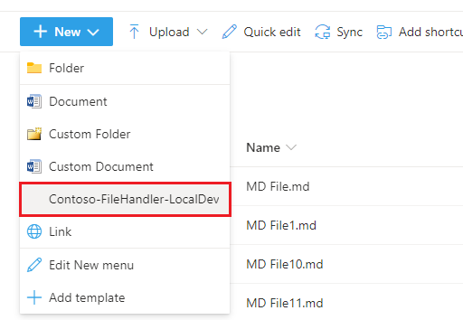
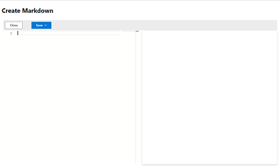
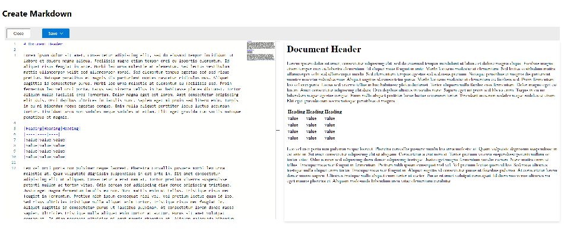
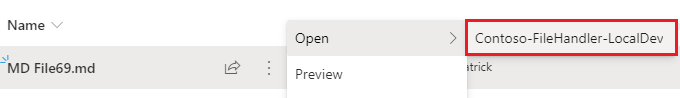
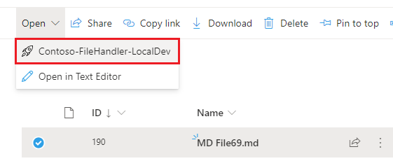
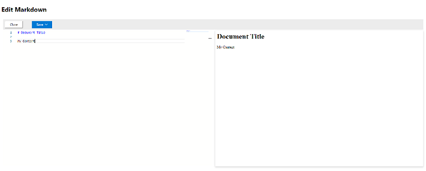
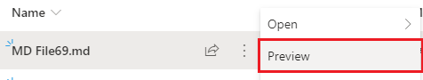
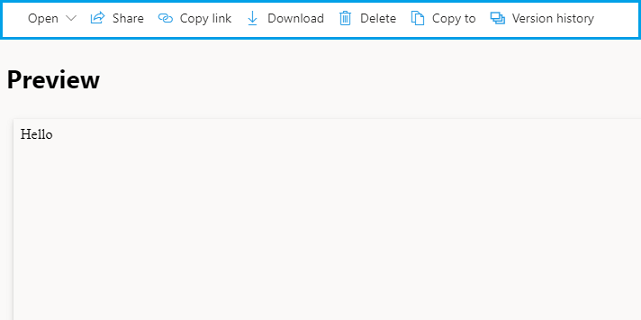

# Contoso File Handler

At Contoso we want to ensure our customers have the best experience with our proprietary file formats when working in Microsoft's SharePoint and OneDrive. To this end we created a [File Handler](https://aka.ms/odsp-file-handlers) for tight integration with the existing files experience. Our file handler allows us to control the create, edit, and preview actions for our registered extensions right from the standard UI.

## Why File Handlers

This example uses Markdown as a custom file format, real-world examples include audio formats, charting files, drafting formats, image formats, or any file type not natively supported in Microsoft 365. The File Handler allows you to build rich tailored experiences for your users. You can also use file handlers to register new capabilities for existing formats such as Markdown which has native support. Your handler will be presented next to the other existing options.

## Integration

Because the application used to implement the file handler is 100% hosted and controlled by us it can be written in any language and make use of any web technology we want. We chose Nodejs because our [SharePoint Framework](https://docs.microsoft.com/en-us/sharepoint/dev/spfx/sharepoint-framework-overview) developers are already familiar with [TypeScript](https://www.typescriptlang.org/) and [React](https://reactjs.org/). Read more about the [technical details behind the solution](./tech-details.md).

### New

When integrating with the new experience our file handler will be available in the "New" menu in OneDrive and SharePoint.

When users select the menu option they will be redirected to the url registered within the [file handler registration](https://docs.microsoft.com/en-us/onedrive/developer/file-handlers/register-manually). This gives us the ability to provide a tailored experience across cloud providers without re-writing our entire codebase. We start with an empty editor in "New":

We show a custom editor that displays the rendered Markdown as the user types:

### Edit

For the editing experience we can click the file name, or use either the context menu:

or the "Open" menu in the top menu bar after selecting a file

Once you open the editor will be presented with a similar view as the create option, except the contents of the existing file are loaded for editing.

### Preview

In preview mode we are able to show a rendered view of an existing file, accessed through the context menu

Once in preview mode SharePoint and OneDrive render some UI elements to help us navigate within the library, highlighted here in blue. The remainder of the page is an iframe of our site where we can render the file.

