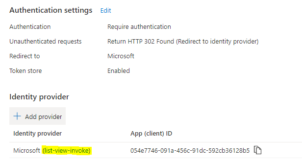
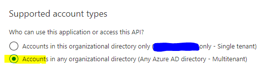

# Enable Multi-Tenant Authentication

This article is an extension of [setup](./setup.md) covering extending your single-tenant testing application to support multi-tenant authentication. Beginning after you have completed all of the steps and tested that your application is working for single tenant you can now enable multi-tenant support.

### Sections

<!-- no toc -->
- [Update AAD Application](#update-aad-application)
- [Update Function App](#update-function-app)
- [Consent to Application in new Tenant](#consent-to-application-in-new-tenant)
- [Deploy App to New Tenant](#consent-to-application-in-new-tenant)
- [Next Steps](#next-steps)
- [Related Links](#related-links)

## Update AAD Application

1. In [Azure Portal](https://portal.azure.com/) locate the function application you created. Select "Authentication" under the "Settings" heading.
2. Select the link to the associated Azure Active Directory Application registration

    

3. Select "Expose an API" under the "Manage" heading. Update the App ID URI to a value including your tenant host name. Previously we used URL of the azure function application, which was OK for single tenant, but multiple tenants must have a way to uniquely identify your application. So a value "https://myfunc.azurewebsites.net" will become "https://{tenant}.onmicrosoft.com/myfunc".
4. Select "Authentication" under the "Manage" heading. Update the Supported account types settings to Multitenant and select "Save" at the top. 

    

## Update Function App

1. In [Azure Portal](https://portal.azure.com/) locate the function application you created. Select "Authentication" under the "Settings" heading.
2. Select the pencil icon to edit the Identity Provider.
3. Clear the issuer URL entry so it is blank and select "Save"

## Consent to Application in new Tenant

1. Open the URL to your function app in a window authenticated to the target tenant and follow the authentication and consent flow. If you would like you may consent on behalf of your organization. This step is required to ensure our multi-tenant settings are working and to create the Enterprise Applicaiton entry in the new tenant so it can be found when approving the API permissions.

## Deploy App to New Tenant

Follow the [docs to deploy the solution](https://docs.microsoft.com/en-us/sharepoint/dev/spfx/extensions/get-started/building-simple-cmdset-with-dialog-api#deploy-the-extension-to-sharepoint-online) and approve the permissions in the SharePoint admin site for the API.

You will need to approve the API permissions in the SharePoint admin center for each tenant to which you deploy the solution.

[back to setup index](#sections)

## Next Steps

- [Submit to Store](https://docs.microsoft.com/en-us/sharepoint/dev/spfx/publish-to-marketplace-overview)

## Related Links

- [Consume multi-tenant enterprise APIs secured with Azure AD in SharePoint Framework](https://docs.microsoft.com/en-us/sharepoint/dev/spfx/use-aadhttpclient-enterpriseapi-multitenant)

