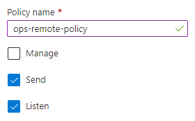
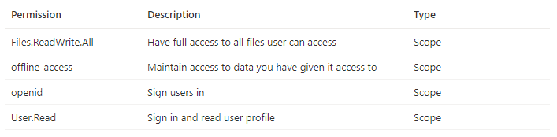

# Demo Setup

The demo has a number of piece to setup and this guide will step through each. The steps are ordered as some information is needed in subsequent steps or some actions need happen ahead of others. Please follow the guide to ensure your solution is properly configured.

### Sections

<!-- no toc -->
- [Create Service Bus Queue](#create-service-bus-queue)
- [Create Azure App Function](#create-azure-functions-app)
- [Configure AAD App Settings](#configure-aad-app-settings)
- [Deploy Azure Function App](#deploy-azure-function-app)
- [Update SPFx Solution](#update-spfx-solution)

## Create Service Bus Queue

1. In [Azure Portal](https://portal.azure.com/) select "Create a resource"
2. Search for "service bus" and select the "Service Bus" option, then "Create"

    

3. Select the subscription, resource group, namespace, and location then select "Review + Create"
4. Review your choices and select "Create"
5. Once provisioning is complete select "Go to resource" to load the resource page
6. On the left, select "Queues" under the "Entities" section
7. Select "+ Queue" at the top

    

8. Provide a name for the new queue and note it for later. You may adjust other settings as needed but the remaining defaults are fine for this demo setup. Once ready select "Create"
9. Once created select the name of the new queue to open the details screen
10. On the left, select the "Shared access policies" under the "Settings" section
11. Select "+ Add" at the top
12. Give the policy a name and choose the "Send" and "Listen" options and select "Create"

    

13.  Once created select the policy to expose the keys and connection strings. Copy the value of "Primary Connection String".

    

14. Paste it into a text editor and remove everything after and including the last ";". Note this edited connection string for later.

    _Endpoint=sb://{sb-name}.servicebus.windows.net/;SharedAccessKeyName={key-name};SharedAccessKey={shared-key};EntityPath={path}_

    becomes:

    _Endpoint=sb://{sb-name}.servicebus.windows.net/;SharedAccessKeyName={key-name};SharedAccessKey={shared-key}_

> From this section you should record:
> 
> - Queue Name (step 8)
> - Edited Queue Connection String (step 14)

[back to setup index](#sections)

## Create Azure Functions App

1. In [Azure Portal](https://portal.azure.com/) select "Create a resource" 
2. Search for "function app" and select the "Function App" option, then "Create"

    

3. Select a subscription, resource group, name, and region. For the remaining options:
    - Publish: *Code*
    - Runtime stack: *Node.js*
    - Version: *14 LTS*
4. Select "Review + Create" as we will accept the remaining defaults. Ensure the options are correct and select "Create"
5. Once provisioning is complete select "Go to resource" to load the resource page
6. On the left, select "Authentication" under the "Settings" section
7. Select "Add identity provider"

    

8. In the dropdown select "Microsoft". Accept the defaults as shown below and select "Next: permissions".

    

9. Select "+ Add permission" and choose "User.Read", "offline_access", "openid", and "Files.ReadWrite.All" then select "Add"

    

10. Once the identity provider is created, select the "edit" pencil icon and remove the "v2.0" from the end of the "Issuer URL" value, leaving the final "/" in place. The value should be "https://sts.windows.net/{your-tenant-id}/"

11. At this point, navigate to the url of your function you should be prompted to login and consent to the app permissions. If successful you will be land on a screen similar to below. The url will be of the form https://{app-name}.azurewebsites.net. **This step is required to establish the enterprise app entry used later for app permissions approval.**

    

12. Navigate to "Configuration" under the "Settings" section of the function app. You need to add two keys whose values both come from the previous section on setting up the service bus. Once both are added select "Save" from at the top and "Continue" when prompted to update the app with the new settings.
    
    - *ServiceBusConnection* = The edited service bus connection
    - *ServiceBusQueueName* = The name of the queue
    - *MICROSOFT_PROVIDER_AUTHENTICATION_APPID* = The App ID of the AAD app associated with the function

13. Navigate to "CORS" under "API". Enter a "*" for allowed origins and select "Save" at the top. Depending on your needs you can use this setting to limit what SP sites can call your API. The value of "*" allows all domains to call the service, acceptable for the demo.

> From this section you should record:
> 
> - Azure Function App Url (step 11)

[back to setup index](#sections)

## Configure AAD App Settings

1. In the settings of the function app created in the previous section, select "Authentication" under the "Settings" section
2. Copy the "Display name" and "Application (client) ID" for later
3. Navigate to "Expose an API" under the "Manage" section
4. Update the Application ID URI and set the value to match the URL of the Azure function and select save. The value will be https://{function-app-name}.azurewebsites.net
5. Navigate to "API Permissions" under the "Manage" section
6. Select the "Grant Admin consent" option to consent to all the permissions for the tenant if not already consented.

> From this section you should record:
> 
> - Azure Application Name (step 2)
> - Azure Application ID (step 2)

[back to setup index](#sections)

## Deploy Azure Function App

This section uses the [Azure CLI](https://docs.microsoft.com/en-us/cli/azure/) to conduct the deployment. There are many ways to deploy apps to Azure and you should use the methods most comfortable to you.

1. Open a command window and navigate to the project folder "azure-function"
2. Enter `az login` to login to the Azure instance
3. Run `npm run build`
4. Run `func azure functionapp publish {app-name}`
5. Within the Azure Portal, ensure the app is running and there are no deployment errors

[back to setup index](#sections)

## Update SPFx Solution

1. Open the solution in the "spfx-list-view-command" folder of the "list-view-service-integration" sample
2. Edit the "./config/package-solution.json" file to include the "webApiPermissionRequests" section. Replace {app-name} with the name of your application from the previous section.

        "webApiPermissionRequests": [
            {
                "resource": "{app-name}",
                "scope": "user_impersonation"
            },
            {
                "resource": "Windows Azure Active Directory",
                "scope": "User.Read"
            }
        ],

3. Now you need to update both the "./sharepoint/assets/ClientSideInstance.xml", "./sharepoint/assets/elements.xml", and "./config/serve.json" to include the base function url. In the files locate the URL "https://{app-name}.azurewebsites.net" and replace {app-name} with the name of your application. As well in "./config/serve.json" update the "pageUrl" values to point to your develpment tenant.

[back to setup index](#sections)

## Next Steps

At this point the solution is configured for testing in your local environment. While testing the expected behavior will follow the flow outlined in the [overview page](./index.md).

- [Review the Docs on extending list view command sets](https://docs.microsoft.com/en-us/sharepoint/dev/spfx/extensions/get-started/building-simple-cmdset-with-dialog-api)
- [Review the Docs for deployment](https://docs.microsoft.com/en-us/sharepoint/dev/spfx/extensions/get-started/building-simple-cmdset-with-dialog-api#deploy-the-extension-to-sharepoint-online)

