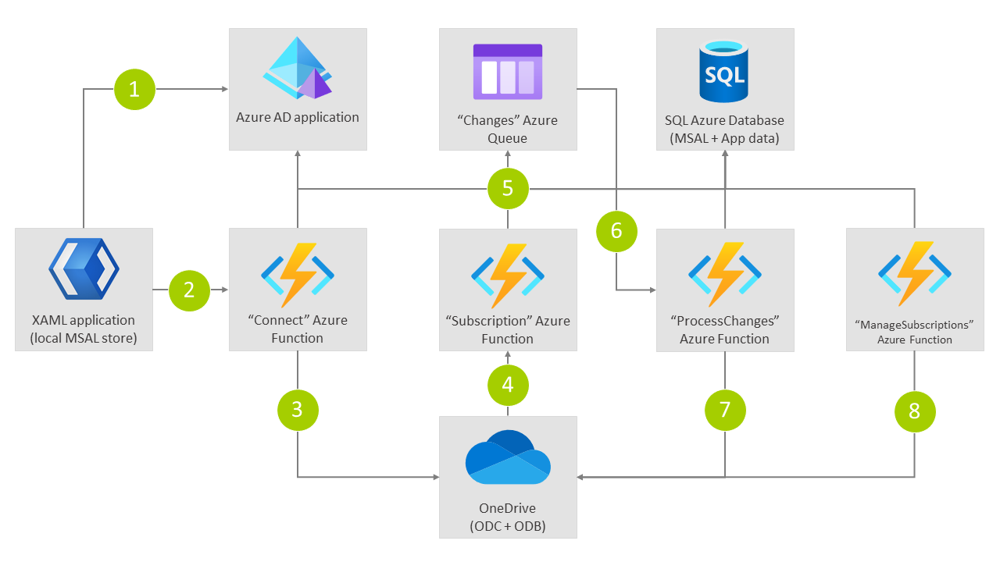

# Using OneDrive as a storage provider storing your application files and have serviecs acting upon these files

This sample application shows how an application (desktop application) can connect with either OneDrive for Business (ODB) or the OneDrive consumer (ODC) service. Once connected a Microsoft Graph subscription is configured which calls into the application's web hook service. The web hook service will queue the change, allowing it to be picked up by a background service which processes the change notification by performing a delta query and getting the actual changes that happened on the user's OneDrive.

## Technology

This sample uses .NET Core 3.1 for all projects:

- FilesApplication: XAML Windows desktop application allowing the user to connect to OneDrive and upload files
- FilesFunction: Azure v3 functions project hosting the connect, web hook, process changes and manage subscriptions Azure functions
- IntegratedTokenCache: Class library shared across all projects, providing the logic needed to persist MSAL cache and application data

For authentication the sample uses Microsoft.Identity.Web and Microsoft.Identity.Client (MSAL), SQL (Azure) is used for centrally storing the distributed token cache and application data.

## Scenario

The following schema shows the scenario realized by this sample:

1. Via a XAML .NET desktop application the user signs in to Azure AD (app with user.read and files.read.all permission) using their MSA (for ODC) or Microsoft 365 account (for ODB). MSAL is used with a custom cache provider that caches the access token and refresh token (information returned via MSAL) locally on the user’s machine, encrypted via the user’s account
2. As part of the sign-in a “connect” Azure function is called, this is using an on-behalf-of auth flow. In here the SQL distributed MSAL cache provider is used, resulting in the user’s (refresh) token being stored in the SQL database
3. The “connect” Azure function sets up a subscription on the user’s ODB/ODC using the “Subscription” Azure function as the web hook service. The .NET Graph SDK is used for this, being called “as the user” since we’re using an on-behalf-of flow. In this step we also call the delta api with a “latest” token and store the resulting change token in the SQL database
4. A file is uploaded to the user’s ODB/ODC and the subscription calls the “Subscription” Azure function
5. The “Subscription” Azure function stores the incoming change notifications as messages in an Azure storage queue. This is needed to provided a timely (within 30 seconds) response to the process calling the “Subscription” Azure function
6. The “ProcessChanges” Azure function is invoked for each message arriving in the queue. As this function needs to act as the user we use the earlier stored MSAL (refresh) token data from the SQL database…MSAL will get us an access token based up on the cached refresh token
7. The “ProcessChanges” Azure function calls the delta API (using the .NET Graph SDK) to get a list of changes. To only retrieve the changes since last invocation it reads and update the last used change token in the SQL Azure database. The retrieved changes are then processed (e.g. pulling down the needed files from the user’s ODB/ODC and processing them)
8. The "ManageSubscriptions" function is fired via a timer and will renew the subscriptions by acting as the respective users that created these subscriptions
